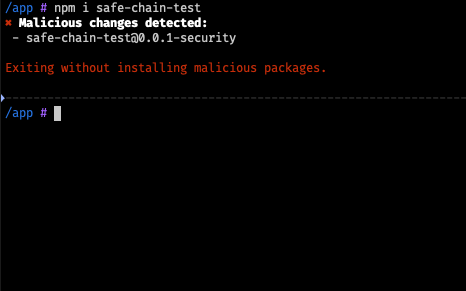

# Aikido Safe Chain

The Aikido Safe Chain **prevents developers from installing malware** on their workstations while developing in the Python ecosystem (through pip or pip3, including `python -m pip[...]` and `python3 -m pip[...]` where available) or in the Javascript ecosystem (through npm, npx, yarn, pnpm, pnpx, bun and bunx). It's **free** to use and does not require any token.

The Aikido Safe Chain wraps around the [npm cli](https://github.com/npm/cli), [npx](https://github.com/npm/cli/blob/latest/docs/content/commands/npx.md), [yarn](https://yarnpkg.com/), [pnpm](https://pnpm.io/), [pnpx](https://pnpm.io/cli/dlx), [bun](https://bun.sh/), [bunx](https://bun.sh/docs/cli/bunx), and [pip](https://pip.pypa.io/) to provide extra checks before installing new packages. This tool will detect when a package contains malware and prompt you to exit, preventing npm, npx, yarn, pnpm, pnpx, bun, bunx, or pip/pip3 from downloading or running the malware.



Aikido Safe Chain works on Node.js version 18 and above and supports the following package managers:

- ✅ **npm**
- ✅ **npx**
- ✅ **yarn**
- ✅ **pnpm**
- ✅ **pnpx**
- ✅ **bun**
- ✅ **bunx**
- ✅ **pip**
- ✅ **pip3**

# Usage

## Installation

Installing the Aikido Safe Chain is easy. You just need 3 simple steps:

1. **Install the Aikido Safe Chain package globally** using npm:
   ```shell
   npm install -g @aikidosec/safe-chain
   ```
2. **Setup the shell integration** by running:
   ```shell
   safe-chain setup
   ```
3. **❗Restart your terminal** to start using the Aikido Safe Chain.
  - This step is crucial as it ensures that the shell aliases for npm, npx, yarn, pnpm, pnpx, bun, bunx, and pip/pip3 are loaded correctly. If you do not restart your terminal, the aliases will not be available.
4. **Verify the installation** by running one of the following commands:

   For JavaScript/Node.js:
   ```shell
   npm install safe-chain-test
   ```

   For Python:
   ```shell
   pip3 install safe-chain-pi-test
   ```

   - The output should show that Aikido Safe Chain is blocking the installation of these test packages as they are flagged as malware.

When running `npm`, `npx`, `yarn`, `pnpm`, `pnpx`, `bun`, `bunx`, `pip`, or `pip3` commands, the Aikido Safe Chain will automatically check for malware in the packages you are trying to install. It also intercepts Python module invocations for pip when available (e.g., `python -m pip install ...`, `python3 -m pip download ...`). If any malware is detected, it will prompt you to exit the command.

You can check the installed version by running:

```shell
safe-chain --version
```

## How it works

The Aikido Safe Chain works by running a lightweight proxy server that intercepts package downloads from the npm registry and PyPI. When you run npm, npx, yarn, pnpm, pnpx, bun, bunx, `pip`, or `pip3` commands, all package downloads are routed through this local proxy, which verifies packages in real-time against **[Aikido Intel - Open Sources Threat Intelligence](https://intel.aikido.dev/?tab=malware)**. If malware is detected in any package (including deep dependencies), the proxy blocks the download before the malicious code reaches your machine.

The Aikido Safe Chain integrates with your shell to provide a seamless experience when using npm, npx, yarn, pnpm, pnpx, bun, bunx, and pip commands. It sets up aliases for these commands so that they are wrapped by the Aikido Safe Chain commands, which manage the proxy server before executing the original commands. We currently support:

- ✅ **Bash**
- ✅ **Zsh**
- ✅ **Fish**
- ✅ **PowerShell**
- ✅ **PowerShell Core**

More information about the shell integration can be found in the [shell integration documentation](docs/shell-integration.md).

## Uninstallation

To uninstall the Aikido Safe Chain, you can run the following command:

1. **Remove all aliases from your shell** by running:
   ```shell
   safe-chain teardown
   ```
2. **Uninstall the Aikido Safe Chain package** using npm:
   ```shell
   npm uninstall -g @aikidosec/safe-chain
   ```
3. **❗Restart your terminal** to remove the aliases.

# Configuration

## Logging

You can control the output from Aikido Safe Chain using the `--safe-chain-logging` flag:

- `--safe-chain-logging=silent` - Suppresses all Aikido Safe Chain output except when malware is blocked. The package manager output is written to stdout as normal, and Safe Chain only writes a short message if it has blocked malware and causes the process to exit.

Example usage:

```shell
npm install express --safe-chain-logging=silent
```

# Usage in CI/CD

You can protect your CI/CD pipelines from malicious packages by integrating Aikido Safe Chain into your build process. This ensures that any packages installed during your automated builds are checked for malware before installation.

For optimal protection in CI/CD environments, we recommend using **npm >= 10.4.0** as it provides full dependency tree scanning. Other package managers currently offer limited scanning of install command arguments only.

## Setup

To use Aikido Safe Chain in CI/CD environments, run the following command after installing the package:

```shell
safe-chain setup-ci
```

This automatically configures your CI environment to use Aikido Safe Chain for all package manager commands.

## Supported Platforms

- ✅ **GitHub Actions**
- ✅ **Azure Pipelines**

## GitHub Actions Example

```yaml
- name: Setup Node.js
  uses: actions/setup-node@v4
  with:
    node-version: "22"
    cache: "npm"

- name: Setup safe-chain
  run: |
    npm i -g @aikidosec/safe-chain
    safe-chain setup-ci

- name: Install dependencies
  run: |
    npm ci
```

## Azure DevOps Example

```yaml
- task: NodeTool@0
  inputs:
    versionSpec: "22.x"
  displayName: "Install Node.js"

- script: |
    npm i -g @aikidosec/safe-chain
    safe-chain setup-ci
  displayName: "Install safe chain"

- script: |
    npm ci
  displayName: "npm install and build"
```

After setup, all subsequent package manager commands in your CI pipeline will automatically be protected by Aikido Safe Chain's malware detection.
